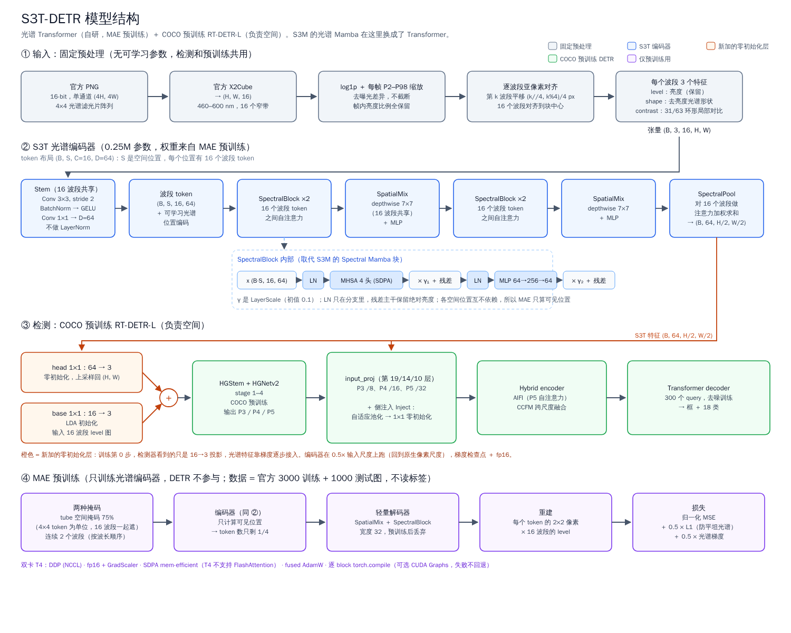

# S3T：面向 HOD26 高光谱目标检测的光谱 Transformer

> 参考 S3M 技术报告（ICPR 2026 "Beyond Visible Spectrum" 分类方案）的设计，按本比赛重新设计。
> S3M 的光谱 Mamba 流在这里**全部换成 Transformer**；空间部分不再自己搭，直接使用 COCO 预训练的 RT-DETR-L。
>
> **2026-09-23 更新**：编码器换成 **S3T-X**（通道协方差注意力，见 4.2）。原来的 band-token 编码器在检测时要 3.4 s/step，11 小时训不完；S3T-X 是 0.50 s/step。MAE 升级到 v3（修掉特征泄漏，见 5.1），检测头加了 D-FINE 分布回归和 MAL（见 4.4）。4.5–4.8 节保留旧编码器的设计作记录。



（矢量版：[`s3t_architecture.svg`](s3t_architecture.svg)，由 `tools/draw_s3t_arch.py` 生成）

## 1 为什么用高光谱

本比赛的 18 类中有多组"外形相同、材质不同"的配对（apple / apple_plastic、egg / egg_plastic / egg_wood、car / car_toy），它们只能靠光谱区分。另一方面，我们的误差分解显示：模型已经找到了 98.3% 的目标，其中 99.9% 类别判对；剩下的差距全部在**框不够紧**，集中在 stone_block、people、e-bike、car 这四类。CPU 扫描发现，这四类的光谱几乎就是背景光谱乘上 0.68–0.90 的亮度系数（"灰对灰"）。所以模型既要能读懂光谱，又必须**保留绝对亮度和局部对比**，这是下文几处关键改动的出发点。

## 2 数据处理

- **传感器**：XIMEA MQ022HG-IM-SM4X4-VIS3，4×4 光谱滤光片阵列（SFA），460–600 nm，16 个窄带。
- **去马赛克**：使用官方 `X2Cube`，得到 (H, W, 16)。我们的实现 `hod26.cube.x2cube` 在测试中与官方函数逐位一致。
- **逐波段亚像素对齐（S3M 没有这一步）**：X2Cube 把原图位置 (4i + k//4, 4j + k%4) 的像素放到 cube[i, j, k]，所以第 k 个波段的实际采样点相对 cube 像素偏移了 (k//4, k%4)/4 个像素，波段之间最多相差 3/4 个像素。在目标边缘，这会让"一个像素的光谱"其实混进了相邻像素。我们按这个已知偏移做线性重采样，把 16 个波段对齐到 4×4 块的中心。测试中，对齐前同一线性梯度场上 16 个波段读数相差超过 1，对齐后相差不到 0.001。
- **波长顺序**：mosaic 编号并不是波长顺序。由相邻波段相关性恢复出的顺序是 `[15,13,14,12,10,8,9,7,6,1,0,2,3,5,4,11]`，band 4 和 band 11 错位。凡是需要"波长相邻"的地方（连续光谱掩码、光谱梯度损失、S-G 平滑）都按这个顺序来。
- **归一化**：先取 log1p 辐亮度，再把每帧的 P2–P98 线性映射到 0–1。只做缩放、**不截断**，这样帧内所有亮度比例都保留下来。数据是辐亮度而不是反射率，每帧缩放可以消除曝光差异。
- **只用官方图片**：MAE 用的是官方全部 4000 帧（训练 3000 + 测试 1000），不读标签，也不含任何增强生成的图片。

## 3 相关工作（与 S3M 报告相同，略）

3D CNN → Transformer（SST、HyperSIGMA）→ Mamba（S²Mamba）。**对本比赛而言**，光谱序列只有 16 个 token，Mamba 的核心卖点（线性复杂度）用不上；自注意力的开销可以忽略，天然是双向的，而且不需要额外编译 `mamba-ssm` 的 CUDA 扩展。这就是 S3T 用 Transformer 替换 Mamba 的理由。

## 4 模型架构

### 4.1 先验特征（替代 S3M 的植被指数）

460–600 nm 里既没有红边也没有 NIR，NDVI 这一类指数根本算不出来。我们改为给每个波段附上 3 个特征，这些特征都经过 CPU 扫描实测：

| 特征 | 定义 | 作用 |
| --- | --- | --- |
| level | 归一化后的 log 辐亮度 | 保留绝对亮度，这是灰色类别唯一剩下的线索 |
| shape | level 减去该像素 16 个波段的均值 | 去掉亮度后的光谱形状 |
| contrast | level 减去 63px 环形窗口（中心 31px 挖空）的背景均值 | 局部对比。窗口要挖空中心，否则背景均值里会混进目标本身 |

第二轮扫描中，`shape + lr_ann63` 组合把弱类的 AUC 从 0.711 提到 0.728、边缘 d′ 从 0.26 提到 0.28，其余类别的 AUC 从 0.895 提到 0.922、边缘 d′ 从 0.93 提到 1.02，是所有测过的变换里最均衡的。

### 4.2 S3T-X 编码器（当前版本，`src/hod26/s3t/xca.py`）

**为什么换**：旧编码器每个位置存 16 个 token × 64 维 = 1024 个数，比一个像素的原始信息（48 个数）多 20 多倍。1024² 的输入有约 105 万个 token，每个 LayerNorm、线性层、拷贝都按这个状态量计算，一步 3.65 s 里有 3.3 s 花在它身上。attention 本身只占约 2%，所以换线性注意力解决不了问题，要减的是状态量。

**做法**：每个位置只保留一个 64 维向量，波段之间的内容相关混合改用通道协方差注意力（XCiT 的 XCA、Restormer 的 MDTA、MST++ 的 spectral-wise attention）：

```
XCA(Q, K, V) = V · softmax(K̂ᵀ Q̂ · τ)，Q̂、K̂ 沿像素做 L2 归一化，τ 每个头可学
```

d×d 的注意力矩阵，是这些像素上特征的归一化互协方差，计算量对像素数是线性的。

**为什么适合这个数据**：在局部窗口里，K̂ᵀQ̂ 就是局部背景的光谱协方差，对 V 做 softmax 混合，相当于可学习的软局部白化，也就是 local RX 检测器背后的运算（用到局部背景的马氏距离）。CPU 扫描里，灰色弱类只有相对局部背景才可分，local RX 对 e-bike 和 car 最好。所以：
- 前两个 block 用 16×16 的窗口（约 32 原生像素，对应之前有效的 31px 环形窗口）；
- 后两个 block 用全图，做光照这类场景级的归一化。

**结构**：
- stem：Conv 3×3 stride 2，接 GELU，再接 Conv 1×1；
- 4 × [LN → XCA（qkv 1×1 + depthwise 3×3）→ LayerScale 残差；LN → GDFN（门控 depthwise FFN）→ LayerScale 残差]；
- 最后一个逐像素 LN。全程 channels_last，0.21M 参数。
- **没有 BatchNorm**：MAE 时 75% 的位置是 0，BN 统计量会被带偏；检测时每卡 2 张图，统计量也不稳。
- **亮度保留**：输入不做逐像素归一化，LN 只在残差分支里。
- **MAE 掩码**：q、k 在被遮位置置 0，所以协方差只来自可见像素；每个分支卷积前的归一化输入也乘上可见掩码（FCMAE 的做法），可见输出读不到被遮位置，连 LayerNorm 对 0 向量输出的常数也读不到。缺失的波段加一个可学习向量，和"值本来就是 0"区分开。

### 4.3 接入 DETR（`S3TXFront`）

在两边网格本来就对齐的地方接：
- 编码器在 0.5 倍输入上以 stride 2 运行，网格是输入的 stride 4，正好和 HGStem 的输出（48 通道）一样。用零初始化的 1×1 卷积（64→48）加到 HGStem 输出上。不再上采样到原图，也不再加宽全分辨率 stem 的第一层卷积。
- 可学习的 stride-2 卷积金字塔（每级后接 LN）把特征送到 stride 8/16/32，经零初始化的 1×1 加到 P3/P4/P5 的输入投影上（第 19、14、10 层），代替平均池化：几像素大的目标一平均就混进背景了。
- P3/P4 注入前先对 AIFI 的全局 token 做交叉注意力（空间 → 光谱），同 4.8 节。
- 16→3 投影照常送进 COCO stem；第 0 步整个检测器和 COCO RT-DETR 在投影上的输出完全一致（测试核对）。

### 4.4 检测头与 loss：D-FINE FDR + GO-LSD + MAL

误差分解里，匹配框的中位 IoU 是 0.864，扣分主要在 IoU 0.9 以上。所以：
- **FDR**：RT-DETR 每层 decoder 旁边加一个零初始化的 3 层 MLP，对每条边预测 33 个偏移量上的分布（D-FINE 的 W(n)：越靠近 0 越密，端点 ±4，单位是边长/4）。框 = 预训练 box head 的框，每条边再移动分布的期望。
  - 不像原版 D-FINE 那样替换 box head：COCO 学到的回归能力保留，第 0 步分布均匀、期望为 0，输出和 COCO decoder 完全一致。
  - 细化后的框同时作为下一层的参考框。
- **FGL**（0.15）：匹配到的 GT 边偏移拆到相邻两个 bin 上，对分布做交叉熵，按 IoU 加权；复用 loss 自己的匈牙利匹配（含 denoising query）。
- **DDF / GO-LSD**（1.5）：最后一层的框作为老师，换算到前面各层的参考框坐标下，蒸馏给它们的分布；匹配上的 query 按 IoU 加权，没匹配上的按老师的置信度加权，正负样本按 D-FINE 平衡。和原版的区别：原版各层分布共用第 0 层的参考框，可以直接做 KL；这里各层参考框不同，所以蒸馏的是老师的框，而不是整条分布。
- **MAL**（DEIM）：正样本权重 1、目标 IoU^1.5；负样本保留 RT-DETR 的 α·p^γ。
- **log-size L1**：宽高在 log 空间做 L1。
- DEIM 的 Dense O2O 由 mosaic 提供。

### 4.5 （旧版）删掉 IWS（S3M 在这里有问题）

S3M 的 IWS 模块给每个通道乘一个与输入内容无关的系数 α ∈ (0, 1)，紧接着是逐波段的线性卷积 PatchEmbed 和 LayerNorm。线性卷积会把 α 原样带过去，LayerNorm 再把尺度归一化掉，α 的作用几乎被完全抵消。另外，传感器固定时波段也固定，"Fourier(λ) → MLP"实际上就是学 16 个常数。S3T 不用 IWS，波段身份交给一个可学习的光谱位置编码（S3M 4.4 节）。

### 4.6 （旧版）Stem（替代 S3M 的 PatchEmbed）

- 所有波段共享一个重叠卷积：Conv 3×3，stride 2 → BatchNorm → GELU → Conv 1×1。输出为 (B, S, C=16, D=64)。
- **不在每个 token 上做 LayerNorm**。如果一个 patch 亮度均匀、值为 b，它的 embedding 是 b·v，LayerNorm 之后 b 就被消掉了，而亮度正是灰色类别的关键线索。测试中专门检查了"整体亮度翻倍时输出会改变"这一点。
- 用 stride 2 而不是 stride 4 的 patchify：cube 本身已经是原图缩小 4 倍的结果，再用 stride 4，11×20 px 的 stone_block 只剩 3×5 个 token。

### 4.7 （旧版）光谱 Transformer 块（替代 SpectralMambaBlock）

```
x: (B, S, C, D) → (B·S, C, D)
x ← x + γ1 · MHSA(LN(x))      # 在 16 个波段 token 上做自注意力，4 头，SDPA 实现
x ← x + γ2 · MLP(LN(x))       # 4D 中间维度
```

- γ 是 LayerScale（初值 0.1）。LayerNorm 只放在残差分支里，残差主干保留绝对亮度。
- 不同空间位置之间互不依赖，所以 MAE 预训练时**只需要计算没被遮住的位置**。
- 每两个光谱块后面接一个 **SpatialMix**：各波段共享的 7×7 depthwise 卷积，再接一个 MLP。被遮住的位置按 0 输入（FCMAE 的稀疏卷积做法），可见 token 读不到被遮住的内容。这一点有专门的测试。

### 4.8 （旧版）光谱聚合与检测接口

- **SpectralPool**：按内容对 16 个波段 token 做注意力加权求和，得到 (B, D, H/2, W/2)。
- **主通路（stem 加宽）**：S3T 的 64 维特征上采样回原图分辨率，与一个 16→3 投影（LDA 初始化）拼接成 3 + 64 个通道，送入 COCO 预训练的 RT-DETR stem。stem 第一层卷积从 3 个输入通道加宽到 67 个：前 3 个通道沿用 COCO 权重，新增的 64 个初始化为 0（I3D 的通道膨胀 + ControlNet 的零初始化）。这样既不经过 3 通道瓶颈（旧做法是先把 64 维压成 3 通道再加上去，原图分辨率上的细节只能走这 3 个数），第 0 步又和预训练 stem 看投影完全一致。
- **侧注入**：S3T 特征池化到 P3、P4、P5 三个尺度，经零初始化的 1×1 卷积，加到 hybrid encoder 的三个输入投影上（第 19、14、10 层）。
- **空间 → 光谱（双向交换）**：RT-DETR-L 里 AIFI（第 11 层，P5 上的全局自注意力）比 P4、P3 的输入投影（第 14、19 层）先执行。所以在 P3、P4 注入之前，先让池化后的光谱特征作 query，对 AIFI 输出的全局 token（imgsz 1024 时约 32×16 个，256 维）做一次 4 头交叉注意力，两边都加归一化坐标的 2D 正弦位置编码，残差相加后再经零初始化的 1×1 卷积注入。这样光谱特征能读到 COCO 预训练的场景和背景上下文，对应 S3M 里的流间双向交换，而不需要让 DETR 跑两遍。P5 的注入点（第 10 层）在 AIFI 之前，保持单向。不改成"完全并行、只在后面融合"：那样会丢掉原图分辨率上的光谱细节，而框不紧正需要这些细节。
- S3M 的融合门写的是"初始化为 0，所以训练初期影响为零"，但它用的是 sigmoid(0)，实际等于 0.5。S3T 的零初始化是真正的恒等：训练第 0 步，检测器看到的只是那个 16→3 投影（测试里逐项核对过，误差 < 1e-5）。
- ultralytics 会把 493×241 的 cube 放大到 imgsz=1024 左右，所以编码器先把输入缩到 0.5 倍，回到 MAE 预训练时的原生像素尺度，显存也降到四分之一。编码器用梯度检查点，内部用 fp16。

## 5 训练

### 5.1 MAE v3（当前版本，`src/hod26/s3t/mae3.py`）

**v1/v2 的特征泄漏**：特征是在 mask 之前算的。
- shape 要减去全部 16 个波段的均值。只遮 1 个波段时，同一像素任意一个可见波段的 level − shape 就是这个均值，被遮波段可以精确解出来；遮 k 个波段时，它们的和也泄漏了。
- contrast 的环形均值把被遮像素也算进去了。

**v3**：先 mask，再用 `observed_features` 计算特征：
- shape 只减存在的波段的均值；
- contrast 用归一化卷积，只对环形窗口里看得见的像素取均值；
- 图像外面也当作"看不见"。

检测前端用同一个函数（没有遮挡），所以微调和预训练看到的输入完全一致。

**掩码与损失**同 v2：2×2 token 单位、遮挡比例 0.5→0.75 逐步加大、1–4 个波段（70% 按波长连续）、空间和光谱补全分开计算并各有参照。

**解码器**：2 层全局 attention（2D 正弦位置编码）加 1 个窗口 XCA block，线性头输出每个位置 16 波段 × 2×2 像素。

**编码器是稠密计算**，被遮位置保持 0：S3T-X 足够便宜，不需要只算可见位置。

**首轮**（双卡 T4，每卡 48 个 128px 裁块，114 crops/s）：1400 步时 band/interp 0.45、spat/mean 0.59、灰块率 0.01。

### 5.1b （旧版）MAE v1/v2 预训练（只训练光谱编码器，DETR 不参与）

- **Tube 空间掩码**：以 4×4 个 token（原生 8×8 px）为单位，遮掉 75%，16 个波段同时遮住。
- **连续光谱掩码**：按波长顺序遮掉连续 2 个波段（15%）。
- **损失**：逐 token 归一化 MSE（除以 target 的标准差再加 0.05，防止平坦区域数值爆炸）+ 0.5 × 未归一化 L1 + 0.5 × 光谱梯度损失（沿波长顺序做一阶差分）。S3M 报告自己也指出，只用归一化 MSE 时模型可以靠输出平坦光谱来刷低 loss；加上 L1 就堵住了这个漏洞。
- **解码器**：1 层 SpatialMix + 1 层光谱块，宽度 32，MLP 扩展比 2。预训练结束后丢弃。
- **双卡 T4 加速**：
  - DDP（NCCL）。
  - fp16 autocast + GradScaler（T4 不支持 bf16）。
  - SDPA 实际走 mem-efficient 后端。FlashAttention 需要 sm80 以上，T4 是 sm75，用不了。
  - 编码器只计算可见位置。
  - fused AdamW、channels_last、pin_memory 并常驻 DataLoader worker。
  - `torch.compile`：第一轮对 DDP 包装后的整个模型编译，两次都触发了 inductor 的 stride 断言，退回普通模式（退回后吞吐约 51 crops/s，冒烟测试中编译模式约 54 crops/s）。现已改为逐个 block 原地编译，并关掉 dynamo 的 `optimize_ddp`，可选再加 CUDA Graphs（`--compile-mode reduce-overhead`）来合并小 kernel、省掉 kernel 启动开销；冒烟测试 kernel 会在双卡上对比不编译、编译融合、编译融合加 CUDA Graphs 这三种方案的吞吐和 GPU 利用率。编译失败不会自动回退，直接报错停止，保证测到的速度就是所选方案的速度；batch 放不下同样直接报错，并给出能放下的大小。

### 5.2 检测微调

- **从 COCO 开始**（不接旧 checkpoint）：RT-DETR-L，imgsz 1024，每卡 batch 2，双卡 DDP，nbs=64，48 epoch。
- **加速**：
  - AMP fp16，loss 和匈牙利匹配强制 fp32（ultralytics 提醒过它在 fp16 下可能出 NaN）；
  - RT-DETR 的 `nn.MultiheadAttention` 换成走 SDPA 的版本（mem-efficient kernel）；
  - S3T-X block 逐个 `torch.compile`；
  - fused AdamW（逐个 param group 确认真的开了）；
  - cudnn.benchmark。
- **保存**：每个 epoch 把 last.pt 复制到输出目录（带 optimizer，可续训）；best.pt 每次更新都复制。
- 数据增强见 `handoff/S3T.md`：离线的 S-G 平滑（沿波长顺序）、同类 SMOTE、超像素 CutMix，每帧额外生成 1 份副本；在线的 mosaic、翻转、缩放。
- 600 张验证集不参与训练，用 pycocotools 计算 mAP50-95 作为唯一的比较标准。

## 6 不足

- S3T-X 检测的速度和显存在 T4 上测过（探针），完整训练还没有在 GPU 上跑完；CPU 上用合成数据端到端跑通过（渲染、训练、保存 best/last、重载、预测）。
- D-FINE 的 GO-LSD 做了改动：各层参考框不同，蒸馏的是老师的框而不是整条分布，见 4.4。
- 计划中"对齐阶段冻结 DETR"这一步没有实现。现在靠零初始化和从头开始的完整微调来代替。
- 计划中给检测头加 P2 这一步没有实现，这需要改 RT-DETR 的解码器结构，风险太大。
- 逐 block 编译加 CUDA Graphs 只在 CPU 上验证过能正常训练，在 GPU 上的提速效果要等下一个账号跑冒烟测试确认。

## 引用

S3M 报告；He et al., *Masked Autoencoders*（2022）；Tong et al., *VideoMAE*（2022）；Woo et al., *ConvNeXt V2 / FCMAE*（2023）；Xiao et al., *Early Convolutions Help Transformers See Better*（2021）；Zhao et al., *RT-DETR*（2024）；Touvron et al., *CaiT / LayerScale*（2021）；El-Nouby et al., *XCiT*（2021）；Zamir et al., *Restormer*（2022）；Cai et al., *MST++*（2022）；Peng et al., *D-FINE*（2025）；Huang et al., *DEIM*（2025）；Reed & Yu, *RX anomaly detector*（1990）。
