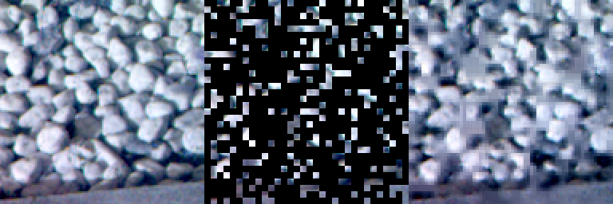

# S3T-DETR 接力：S3T-X 光谱编码器 + COCO RT-DETR + D-FINE，双卡 T4

这是一条**独立于 `README.md` 那条续训路线**的新模型线：从 COCO 开始训练，不接旧 checkpoint。README 里的 epoch-21 续训依然有效。

## 一句话

在 COCO 预训练的 RT-DETR-L 前面，加一个自己设计的**光谱编码器 S3T-X**（逐像素的通道协方差注意力），用 MAE 在官方 4000 张图上预训练。检测头在 RT-DETR 自己的 decoder 上加了 **D-FINE 的分布回归**，分类用 **MAL**。所有新加的层都零初始化，训练第 0 步就是原封不动的 COCO RT-DETR。

## 现状（2026-09-23 11:30 UTC）

| 环节 | 状态 | 在哪里 |
| --- | --- | --- |
| 速度探针（T4，1024²，真实 loss） | **完成**，S3T-X 通过，见下 | `zetaoxia/hod26-s3t-detr-probe` v5–v7 |
| MAE v3 预训练（S3T-X，修掉特征泄漏） | **完成**：6358 步，90.6 分钟，6 项检查全部 PASS | 公开 notebook `zetaoxia/hod26-s3t-mae-pretrain3`，输出 `s3t_mae/pretrain3_mae.pt` |
| 检测：S3T-X 前端 + D-FINE + MAL + 数据增强 | **代码完成**，CPU 上端到端跑通（渲染 → 训练 → 保存 best/last → 重载 → submission.csv） | `tools/s3t_round.py` 生成 `handoff/s3t/hod26_round.py` |
| 正式检测训练 | **运行中**：11:28 UTC 开始，从 COCO 训练 45 epoch，预计约 9.2 小时 | `zetaoxia/hod26-s3t-detr` v2 |

旧的 band-token 编码器（MAE v1/v2）已经停用。v2 那一轮是按用户要求中途删除的，原因见"为什么换成 S3T-X"。

## 为什么换成 S3T-X（速度探针）

旧编码器每个位置保存 16 个波段 token × 64 维 = 1024 个数，是一个像素原始信息（16 波段 × 3 个特征 = 48 个数）的 20 多倍。1024² 的输入有约 105 万个 token，一步训练里 3.3 s 花在它身上；attention 本身只占约 2% 的计算，所以换线性注意力解决不了问题，要减掉的是状态本身。

S3T-X 每个位置只保留一个 64 维向量，波段之间的内容相关混合改用**通道协方差注意力**（XCiT / Restormer 的 MDTA / MST++ 的 spectral-wise attention）：

```
XCA(Q, K, V) = V · softmax(K̂ᵀ Q̂ / τ)，Q̂、K̂ 沿像素做 L2 归一化
```

在**局部窗口**上算时，K̂ᵀQ̂ 就是局部背景的光谱协方差，softmax 后作用在 V 上，相当于一个可学习的局部白化，也就是 local RX 检测器背后的运算。弱类（灰色目标对灰色背景）在 CPU 扫描里正好只有相对局部背景才可分。所以前两层用 16×16 的窗口（约 32 原生像素，对应之前有效的 31px 环形窗口），后两层用全图，做场景级的归一化，比如光照。

探针结果（单张 T4，1024²，AMP，loss 和匈牙利匹配用 fp32，每卡 batch 2，同一个 session 里对比）：

| 配置 | s/step | 峰值显存 |
| --- | --- | --- |
| 纯 RT-DETR b2 | 0.323 | 10.5 GB* |
| 纯 RT-DETR b4 | 0.542 | 12.6 GB* |
| S3T-X eager + checkpoint b2 | 0.612 | 3.8 GB |
| S3T-X eager b2 | 0.587 | 5.6 GB |
| **S3T-X 编译 b2（正式训练用这个）** | **0.500** | 5.3 GB |
| S3T-X 编译 + checkpoint b4 | 0.945 | 7.1 GB |
| 旧 band-token 编码器 编译 b2 | 3.39 | 9.8 GB |

\* 纯 RT-DETR 排在第一个跑，峰值里含 cudnn benchmark 试算法时的工作区。

- S3T-X 比旧编码器**快 6.8 倍**，是纯 RT-DETR 的 1.55 倍。
- 没有 NaN。attention 实际走的是 `fmha_cutlassF/B`（mem-efficient 融合 kernel）。
### 第二轮探针：正式配置（S3T-X + D-FINE/MAL，编译，AMP，b2）

| 配置 | s/step | 峰值显存 |
| --- | --- | --- |
| 纯 RT-DETR + D-FINE/MAL，逐层算 loss | 0.422 | — |
| 纯 RT-DETR + D-FINE/MAL，批量 loss | 0.373 | — |
| S3T-X + D-FINE，逐层算 loss | 0.565 | 5.3 GB |
| S3T-X + D-FINE，逐层算 loss，**channels_last** | 0.586 | **12.5 GB** |
| **S3T-X + D-FINE，批量 loss（正式配置）** | **0.508** | 5.3 GB |

- **channels_last 要关**：ultralytics 8.4 在 CUDA 上默认把整个模型转成 channels_last。在这个模型上它更慢，峰值显存还翻了一倍多，离 14.6 GB 上限很近。S3T 这条线显式设成 `channels_last=False`。
- **D-FINE 的 loss 改成跨层批量计算**，去掉逐层循环和 `.any()` 的同步，数值和原实现一致（误差 1e-7）。原先它每步多花约 0.09 s，现在基本没有额外开销。
- **`deterministic=False`**：确定性模式会限制 cudnn 的算法选择，grid_sample 的反向也会变慢。
- **估算**：双卡每步 4 张图，训练集 2400 张加 1 份增强副本共 4800 张，**约 12.3 分钟一个 epoch**。45 个 epoch 约 9.2 小时，留约 1 小时余量，保证最后 3 个关闭 mosaic 的 epoch 一定能跑完。旧流程 52 个 epoch 到了 held-out 0.695。

## 模型结构

- **输入**：官方 X2Cube → log 辐亮度 → 每帧 P2–P98 缩放 → 逐波段亚像素对齐 → 16 通道 uint8。
- **S3T-X 编码器**（0.21M 参数，`src/hod26/s3t/xca.py`）：
  - 输入是每个波段的 3 个特征（level、shape、contrast），缩到 0.5 倍（回到原生像素尺度）。
  - stem 是 3×3 stride 2 卷积，接 4 个 XCA block（窗口 16、16、全图、全图），每个 block 是 XCA 加 GDFN（门控深度卷积 FFN），全程 channels_last。
  - **没有 BatchNorm**：MAE 时 75% 的位置被遮，BN 的统计量会被大量 0 带偏；检测时每卡只有 2 张图，BN 统计量也不稳。
- **接入 DETR**（`S3TXFront`，`src/hod26/s3t/front.py`），在两边网格本来就对齐的地方接：
  - 编码器输出是输入的 stride 4，和 RT-DETR 的 HGStem 输出（48 通道，stride 4）正好是同一个网格，用一个零初始化的 1×1 卷积（64→48）加上去。不再上采样到原图，也不再加宽全分辨率的 stem。
  - 用可学习的 stride-2 卷积金字塔（stride 8/16/32）给 P3/P4/P5 的输入投影做零初始化注入，代替之前的平均池化：几个像素大的目标，平均池化会把它和背景混在一起。
  - P3/P4 注入之前，先对 AIFI 的全局 token 做一次交叉注意力，从空间方向把全局信息送进光谱特征。
  - 16→3 投影照常送进 COCO stem。
- **检测头**：RT-DETR 自己的 decoder（COCO 权重，6 层，300 query，含 denoising），外加 D-FINE 分布回归，见下。

## MAE v3：修掉 v1/v2 的特征泄漏

v1/v2 的特征是在 mask **之前**算好的，有两处泄漏：

1. **shape = level 减去全部 16 个波段的均值**。只遮 1 个波段时，从同一像素任意一个可见波段的 level 和 shape 就能反推出这个均值，被遮波段的值可以**精确算出来**（测试里用这个公式复现了，误差 < 1e-4）。遮 k 个波段时，它们的和也泄漏了。光谱补全本来是要逼编码器学波段之间的关系，结果做算术就能解。
2. **contrast 的环形均值**包含被遮的像素，被遮区域的盒子和会传给旁边的可见像素。

v3 **先 mask，再算特征**（`observed_features`）：
- shape 只减**存在的波段**的均值；
- contrast 用**归一化卷积**，只对环形窗口里**看得见的像素**取均值；
- 被遮的波段额外加一个可学习的"缺失"向量，编码器能分清"这个波段被遮了"和"这个波段本来就是 0"。

检测前端用的是**同一个函数**，只是没有任何遮挡，所以微调时看到的输入和预训练时完全一致。

其他沿用 v2：
- 2×2 token 的掩码单位，遮挡比例 0.5 → 0.75 逐步加大；
- 每次遮 1–4 个波段，70% 是按波长连续的一段；
- 空间补全和光谱补全的 loss 分开算，并各有参照；
- 解码器是 2 层全局 attention 加正弦位置编码，再加 1 个窗口 XCA block。

**v3 结果**（双 T4，90.6 分钟，6358 步 × 每卡 48 个裁块 × 2 卡 ≈ 61 万个裁块，114.8 crops/s，每卡峰值 4.8 GB，GradScaler 2048–32768，无 NaN）。band/interp 和 spat/mean 都是模型误差 ÷ 平凡填充的误差，低于 1 就说明比平凡填充好：

| 步数（中位数） | loss | band/interp（光谱补全 vs 按波长线性插值） | spat/mean（空间补全 vs 可见均值） | grey（整块灰的比例） | 遮挡比例 |
| --- | --- | --- | --- | --- | --- |
| 0–200 | 2.01 | 1.01 | 1.12 | 0.00 | 0.55 |
| 500–1000 | 0.72 | 0.55 | 0.59 | 0.00 | 0.65 |
| 1500–2000 | 0.53 | 0.44 | 0.51 | 0.01 | 0.75 |
| 3000–4000 | 0.44 | 0.37 | 0.50 | 0.02 | 0.75 |
| 5800–6358 | **0.41** | **0.34** | **0.47** | 0.02 | 0.75 |

光谱补全的误差只有波长插值的 34%，而且特征已经没有泄漏，这是编码器靠光谱注意力学出来的，正是弱类需要的能力。v2 报的 0.60 里有泄漏的功劳。重建图（左：原图，中：遮掉 75% 后，右：重建，伪彩用 5/8/13 波段）：



石块的轮廓和明暗都能补出来，没有 v1 那种整块的灰色。

## 检测头与 loss：D-FINE 分布回归 + MAL + log-size L1

误差分析显示，匹配上的框中位 IoU 是 0.864，**扣分主要在 IoU 0.9 以上的高阈值**，所以重点放在框的精度上。

- **D-FINE 分布回归（FDR）**（`FDRDecoder`，`kernels/hod26_round/driver.py`）：
  - 原版 D-FINE 会把 box head 换成新的，这里**不替换**：COCO 预训练的 box head 保留，每层旁边再加一个零初始化的分布头。
  - 分布头对每条边预测 33 个偏移量上的分布；偏移量用 D-FINE 的非均匀 W(n)，越靠近 0 越密，最小一格约是边长的 2%。
  - 框 = 预训练 head 给出的框，每条边再移动分布的期望。
  - 第 0 步分布是均匀的，W 是奇函数，期望恰好是 0，所以输出和 COCO decoder **完全一致**（测试验证）。
- **FGL**（权重 0.15）：用匹配到的 GT 训练每层的分布（目标拆到相邻两个 bin 上，按 IoU 加权）。直接复用 loss 自己的匈牙利匹配，包括 denoising query。
- **GO-LSD / DDF**（权重 1.5）：把最后一层的框蒸馏给前面几层的分布，正负样本按 D-FINE 的方式平衡。
- **MAL**（DEIM）：匹配上的 query 全权重，目标是 IoU^1.5。低 IoU 的匹配会被教成低分，而不是像 VFL 那样被降权、在 loss 里被忽略。
- **log-size L1**：宽高在 log 空间做 L1。
- DEIM 的 Dense O2O 就是 mosaic，本来就开着。

## 保留 best.pt 和 last.pt

输出目录（`/kaggle/working`）里会有：

- `final_last.pt`：**每个 epoch** 都复制一份，带 optimizer 和 EMA，可以直接续训。
- `final_best.pt`：**每次** held-out 分数创新高、ultralytics 重写 best.pt 时都复制一份。训练中途出异常也不会丢；训练结束后再换成去掉 optimizer 的版本。
- `final_results.csv`、`final_metrics.jsonl`：每个 epoch 的记录。

ultralytics 的 `runs/` 目录在 scratch 盘上，session 结束不会保存，所以要靠上面这几份副本。

## 这次修掉的问题（端到端 CPU 测试查出来的）

新增了 `tests/test_s3t_e2e.py`：用合成数据在 CPU 上把 `run_submission` 完整跑一遍。

- **"fused AdamW" 以前其实没开**：重建 optimizer 时，每个 param group 里已经带着 `fused=None`，它会覆盖构造函数传的 `fused=True`，但加速表照样显示 ON。现在逐个 group 设置，并且检查每个 group 都真的是 fused，否则直接报错。
- 以前 best.pt 只在训练正常返回后才复制到输出目录，现在每次更新都复制。

## 你要做的（等 MAE v3 跑完）

1. **检查额度**：约 11–12 小时 GPU。
2. **确认能打开数据集** `xishengfeng/hod26-planar`。
3. 生成并上传检测 kernel：
   ```bash
   python3 tools/s3t_round.py --slug <你的账号>/hod26-s3t-detr --arch xca \
       --mae-kernel zetaoxia/hod26-s3t-mae-pretrain3
   kaggle kernels push -p kernels/s3t_detr/build
   ```
   或者在网页上 Import `handoff/s3t/hod26_round.py`，Input 里挂两项：`hod26-planar` 和 notebook `zetaoxia/hod26-s3t-mae-pretrain3`（公开）。
4. **Accelerator → GPU T4 x2**，**Internet → On**，Save & Run All。

### 前两分钟应该看到

```
preflight ok: S3T MAE encoder /kaggle/input/.../pretrain3_mae.pt (arch xca)
preflight passed
  box loss: GIoU, MAL (target IoU^1.5, positives at full weight), D-FINE FDR (+FGL 0.15, GO-LSD/DDF 1.5) on the pretrained decoder, log-space wh
  S3T encoder: MAE weights from ... (step N)
  S3T-X: cross-covariance attention, windows [16, 16, None, None], channels_last; no checkpoints; encoder trained
  S3T-X front: 0.21M-param encoder at 0.5x input scale, stride-4 output joined to HGStem's 48-ch output (zero-init 1x1); ...
  S3T blocks compiled in place: 4
  acceleration table:
    ON   AMP fp16 (+GradScaler)
    ON   loss + Hungarian matching in fp32
    ON   RT-DETR attention via SDPA  (7 nn.MultiheadAttention swapped)
    ON   fused AdamW
    ON   cudnn.benchmark
    off  FlashAttention / TF32 / bf16  (not supported on T4 (sm75))
  2 GPU(s) visible; DDP across [0, 1], batch 4 (2/card)
```

- `PREFLIGHT FAILED: ... arch='tokens'; the run asks for s3t_arch='xca'`：挂成了旧的 MAE notebook，换成 `pretrain3`。
- `PREFLIGHT FAILED: ... no MAE checkpoint`：notebook 没挂上，**还没花额度**。
- `S3T encoder: NO pretrained weights`：**立刻停掉**并告诉我们。

## 数据增强（正式训练里都开着）

| 类型 | 做法 | 为什么 |
| --- | --- | --- |
| 离线·光谱 | **Savitzky-Golay 沿波长顺序**平滑（窗口 7，2 阶） | mosaic 编号 ≠ 波长顺序，`sg_chain` 按波长顺序平滑 |
| 离线·光谱 | 同类 SMOTE（α=0.3） | 同类目标之间插值，不改标签 |
| 离线·空间 | 超像素 CutMix（p=0.4） | 按超像素整块移植，不切断目标 |
| 离线 | 每帧额外生成 1 份增强副本，训练集变成 2 倍 | |
| 在线（ultralytics） | mosaic、水平翻转、缩放/平移 | 最后 3 个 epoch 关闭 mosaic |
| 不做 | HSV、mixup | 16 通道上 HSV 无意义；mixup 跨类插值 |

MAE 预训练**不做**任何增强：只用官方的 4000 帧原图裁块。验证集（600 张）永远不增强。

## 怎么判断它有没有用

和 README 那条线用同一把尺子：held-out 600 张上的 pycocotools mAP50-95。

| 参照 | held-out | LB |
| --- | --- | --- |
| 当前队伍最佳（epoch-52 微调） | 0.69528 | 0.62994 |

要比参照高出 **0.01 以上**才算有效（run-to-run 噪声约 0.0017）。日志末尾会打印每一类的 AP，重点看弱类（stone_block / people / e-bike / car）。

## 时间安排（截止 2026-09-24 16:00 UTC）

| 时间（UTC） | 内容 |
| --- | --- |
| 09:54 – 11:26 | MAE v3 预训练（90.6 分钟，公开 notebook）✅ |
| 11:28 – 约 21:00 | 检测训练 45 epoch（时钟保护会在超时前停下，并保存 best/last） |
| 之后 | 同一个 session 里预测测试集，写 `submission.csv` |

还有余量：如果第一轮结束后时间和额度都够，可以挂上 `final_last.pt` 再续一轮。

## 历史：band-token 版本（MAE v1/v2）

- **v1**（`qwyi123/hod26-s3t-mae-pretrain`）和 **v2**：逐像素 16 个波段 token 的光谱自注意力。
- 检测时 OOM：一次 checkpoint 包住整个编码器，每张图约 13 GB。改成分块逐层 checkpoint 后能放下，但仍要 3.4 s/step，11 小时训不完。
- 这部分代码还留在 `src/hod26/s3t/spectral.py`、`mae.py`、`mae2.py`，`--arch tokens` 仍可生成。
- 细节见 git 历史里这份文档的旧版本。

## 相关文件

- `src/hod26/s3t/xca.py`：S3T-X 编码器
- `src/hod26/s3t/front.py`：`observed_features`（无泄漏特征）、`S3TXFront`（stem 融合、光谱金字塔）、注入与 AIFI 上下文
- `src/hod26/s3t/mae3.py`：MAE v3
- `kernels/hod26_round/driver.py`：`FDRDecoder`、`fdr_losses`（FGL/DDF）、MAL、best/last 保存
- `tools/train_s3t_mae.py`（`--mae-version 3`）、`tools/build_s3t_smoke.py`（`--mode pretrain`）：MAE 预训练
- `tools/s3t_round.py`：检测 kernel 生成器；`tools/build_s3t_detr_probe.py`：速度探针
- 测试：`tests/test_s3t_xca.py`（编码器、MAE v3、检测前端）、`tests/test_dfine.py`（FDR/FGL/DDF/MAL）、`tests/test_s3t_e2e.py`（端到端）、`tests/test_s3t_detr.py`、`tests/test_s3t.py`
