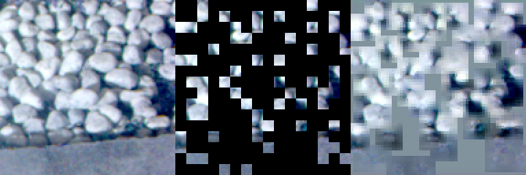

# S3T-DETR 接力：光谱 Transformer + COCO RT-DETR，双卡 T4

这是一条**独立于 `README.md` 那条续训路线**的新模型线。README 里的 epoch-21 续训依然有效，两条线可以二选一，也可以都跑（额度够的话）。

## 一句话

在 COCO 预训练的 RT-DETR-L 前面，加一个自己设计的**逐像素光谱 Transformer**（S3T），用 MAE 在官方 4000 张图上预训练过。空间部分交给 DETR，光谱部分由我们自己的编码器负责。

## 已经完成的

| 环节 | 状态 | 在哪里 |
| --- | --- | --- |
| MAE 预训练（只训光谱编码器，DETR 不参与） | **已完成**（4755 步，64 分钟），结果见下 | 公开 notebook `qwyi123/hod26-s3t-mae-pretrain`，输出 `s3t_mae/pretrain_mae.pt` |
| 检测微调代码（S3T 前端 + 侧注入 + 数据增强） | **已写好，CPU 上测试通过，还没在 GPU 上跑过** | `handoff/s3t/hod26_round.py`（由 `tools/s3t_round.py` 生成） |

### 预训练结果（2026-09-23，双卡 T4，64 分钟，6 项检查全部 PASS）

| 项 | 数值 |
| --- | --- |
| 数据 | 官方全部 4000 帧（训练 3000 + 测试 1000），128px 随机裁块，不翻转，不读标签 |
| 步数 | 4755 步 × 每卡 20 个裁块 × 2 卡 ≈ 19 万个裁块 |
| loss（中位数，按阶段） | 前 170 步 1.52 → 180–570 步 1.01 → 580–1470 步 0.92 → 1480–2970 步 0.82 → 2980–4750 步 0.85 |
| 吞吐 | 50.7 crops/s（双卡合计），等数据 3.8% |
| 显存 | 每卡峰值 9.38 GB / 14.6 GB |
| 加速实际生效 | DDP、fp16 + GradScaler（缩放系数 128–32768，无 NaN）、SDPA mem-efficient、fused AdamW、只算可见位置。**torch.compile 未生效**：这一版在第一步撞到 inductor 的 stride 断言，退回了不编译的普通模式（当时的代码还会自动回退；新代码已改为直接报错停下）。所以 50.7 crops/s 是**不编译**的速度 |
| 输出 | `s3t_mae/pretrain_mae.pt`（编码器 + 解码器 + 配置），`pretrain_encoder_latest.pt` |

loss 在约 1500 步后就基本不降了（0.82–0.85）：1 小时的预训练已经到头，想继续提升要靠更长的训练或更大的模型，而不是在这个配置上多跑。重建图（左：原图，中：遮掉 75% 后，右：重建，伪彩用 5/8/13 波段）：



重建能恢复大致的亮度、颜色和石块的轮廓，细节偏糊，这是 MAE 在 75% 掩码下的正常表现。

## 你要做的（和 README 那条线几乎一样）

1. **检查额度**：需要约 11–12 小时 GPU。
2. **确认能打开数据集** `xishengfeng/hod26-planar`（私有；打不开就先找 xishengfeng 加你为协作者）。
3. kaggle.com → Create → New Notebook → File → Import Notebook，上传：
   <https://raw.githubusercontent.com/Timothy-kira/hyper/claude/kaggle-cli-setup-handoff-9w0v7x/handoff/s3t/hod26_round.py>
4. 右侧面板 → **Input → Add Input**，添加**两项**：
   - Datasets：`hod26-planar`
   - Notebooks：`qwyi123/hod26-s3t-mae-pretrain`（公开 notebook，里面有 `pretrain_mae.pt`）

   **不要**再挂 `hod26-ckpt-s4` / `-s2`：这条线从 COCO 开始，不续训旧 checkpoint。
5. **Accelerator → GPU T4 x2**，**Internet → On**。
6. **Save Version → Save & Run All (Commit)**。

### 前两分钟应该看到

```
preflight ok: 2x GPU Tesla T4
preflight ok: S3T MAE encoder /kaggle/input/.../pretrain_mae.pt
preflight passed
  S3T encoder: MAE weights from ... (step N)
  stem widened: first conv now reads 67 channels (3 pretrained + 64 S3T, zero-initialised)
  S3T front: 0.25M-param spectral Transformer at 0.5x input scale, 3+64 channels into the pretrained HGStem, zero-init side injections at layers [19, 14, 10]; P3/P4 read AIFI's global context (layer 11, 256-d)
  2 GPU(s) visible; DDP across [0, 1], batch 4 (2/card)
```

- 如果看到 `PREFLIGHT FAILED: spectral_stem=s3t but no MAE checkpoint`：第 4 步的 notebook 没挂上。**还没花额度**，挂上再提交。
- 如果看到 `S3T encoder: NO pretrained weights`：说明没找到权重，**立刻停掉**并告诉我们。
- 数据渲染（含每帧 1 份增强副本）需要一段时间，第一条 epoch 日志会晚一些才出来。

**第一次在 GPU 上跑这份检测代码**：CPU 测试覆盖了安装、前向、反向、EMA 深拷贝、保存与加载、验证前的算子融合（fuse），但显存和速度只能在 T4 上才看得到。建议看到**第一条 epoch 日志**再离开。若出现 OOM，把 `train.batch` 从 2 改成 1 重新生成（`python3 tools/s3t_round.py`），或者直接告诉我们。

## 数据增强（正式训练里都开着）

| 类型 | 做法 | 为什么 |
| --- | --- | --- |
| 离线·光谱 | **Savitzky-Golay 沿波长顺序**平滑（窗口 7，2 阶） | mosaic 编号 ≠ 波长顺序（band 4、11 错位），旧代码按编号平滑会把不相邻的波长混在一起；新增 `sg_chain` 修正 |
| 离线·光谱 | 同类 SMOTE（α=0.3） | 同类目标之间插值，不改标签 |
| 离线·空间 | 超像素 CutMix（p=0.4） | 按超像素整块移植，不切断目标 |
| 离线 | 每帧额外生成 1 份增强副本，训练集变成 2 倍 | |
| 在线（ultralytics） | mosaic、水平翻转、缩放/平移 | 最后 3 个 epoch 关闭 mosaic |
| 不做 | HSV、mixup | 16 通道上 HSV 无意义；mixup 跨类插值，理由同 S3M 报告 |

验证集（600 张）**永远不增强**，保证分数衡量的是真实分布。

## 模型结构（详细见 `docs/S3T.md`）


- 输入：官方 X2Cube → log 辐亮度 → 每帧 P2–P98 缩放 → **逐波段亚像素对齐** → 16 通道 uint8。
- S3T 前端：每个波段 token 带 3 个特征（亮度 level、去亮度后的光谱形状 shape、63px 环形背景的局部对比 contrast），经过 4 层**光谱自注意力**（每个像素内 16 个波段 token 之间做 attention）和 2 次局部空间混合，再对波段做注意力池化。
- 两条通路接入 DETR：① **stem 加宽**：64 维 S3T 特征上采样到原图分辨率，与 16→3 投影拼成 67 个通道送进 COCO stem；stem 第一层卷积加宽成 67 个输入通道，前 3 个沿用 COCO 权重，新增 64 个初始化为 0，没有 3 通道瓶颈；② 零初始化的侧注入，加到 P3/P4/P5 的输入投影上；其中 P3/P4 注入前，先对 AIFI 的全局 token 做一次交叉注意力（空间 → 光谱，双向交换）。
- 零初始化意味着训练第 0 步时，检测器看到的就是一个普通的 16→3 投影，光谱特征靠梯度逐步接入，不会一上来就把预训练的 DETR 冲乱。

## 怎么判断它有没有用

和 README 那条线用**同一把尺子**：held-out 600 张上的 pycocotools mAP50-95。

| 参照 | held-out | LB |
| --- | --- | --- |
| 当前队伍最佳（epoch-52 微调） | 0.69528 | 0.62994 |

要比参照高出 **0.01 以上**才算有效（run-to-run 噪声约 0.0017）。这条线是从 COCO 开始训的，不是在我们 52 个 epoch 的模型上续训，所以 11 小时内**不一定能追上**。它真正的价值是看弱类（stone_block / people / e-bike / car）的 AP 有没有涨，日志末尾会打印每一类的 AP。

## MAE 修复与优化计划：在现有权重上继续训练几小时

**状态：计划，代码还没改。** 下面每一项都写明了要改哪里、怎么验证。

### 先说清楚：哪些改进能带进检测

预训练完**只保留编码器**，解码器直接丢掉。所以每一项改进都要问一句：它能不能落到编码器的权重上？

| 改进 | 能否带进检测 | 原因 |
| --- | --- | --- |
| 加强光谱掩码（每次遮 1–4 个波段、有时不连续、光谱补全 loss 加倍） | **能，直接带进** | 可见位置上被遮的波段，完全靠编码器每个像素内部的光谱注意力补出来。练的是编码器，而且正是弱类需要的能力。**优先做这一项** |
| 掩码单位改小、比例逐步加大、难样本挖掘 | **能** | 改变的是编码器必须学会的内容 |
| 解码器加全局注意力和位置编码 | **结构带不过去，但间接有用** | 现在 28.9% 的被遮位置完全看不到可见 token，它们的预测和编码器输出无关，对编码器的**梯度是 0**，这部分 loss 什么都没教给编码器。修好之后，这部分误差才能传回编码器。但解码器也不能太强，否则它自己就把活干完了，编码器反而学得少，所以只加 2 层 |
| loss 拆成两项分别记录 | 不影响权重 | 只用来监控训练 |
| 编码器加**粗网格**全局注意力（SRA） | **能，直接带进** | 编码器的一部分，检测时也在用。不能在细网格上做全局注意力（检测时约 3.2 万个位置，要算约 10 亿对），但先粗化成 16×16 px 的粗块后，全局只有约 512 个粗块，可以承受。详见问题 1 的修复第 3 项 |

**判断标准**是后面的 CPU 检验：看冻住的编码器能不能把四个弱类和背景分开，而**不是**重建图好不好看。灰块消失只说明解码器变强了，不等于编码器变好了。检测微调时编码器也会继续训练，预训练给的只是起点。

### 问题 1：重建里有整块的灰色（已查明原因）

**原因**：解码器只有 1 层 7×7 的 SpatialMix，在 token 网格上只能看到周围 3 格。掩码以 4×4 个 token 为单位、遮掉 75%，大片被遮区域会连在一起。在 64×64 的 token 网格上实测：

| 被遮 token 离最近的可见 token | 占比 |
| --- | --- |
| 超过 3 格（解码器看不到任何真实内容） | **28.9%** |
| 超过 6 格 | 4.2% |
| 最远 | 16 格 |

这 28.9% 的 token 输入只有同一个"掩码向量"。解码器里又**没有空间位置编码**，所以它们的输出完全一样，也就是一整块灰。编码器本身没问题：它只看可见位置，灰块出在解码器看不到那么远。

**修复**（按优先级）：
1. **解码器加全局空间注意力**（MAE 原文的解码器就是全局注意力）：
   - 先把 16 个波段池化成每个位置一个 token，在 64×64 的网格上做 2 层自注意力（4096 个 token，T4 上可以承受；显存不够时先 2× 下采样到 32×32，再上采样回来）；
   - 然后再接回现在的逐波段 SpectralBlock，负责输出光谱。
2. **解码器加 2D 正弦位置编码**：让不同位置的掩码 token 可以区分开。
3. **编码器加一层粗网格全局注意力（SRA，空间缩减注意力，PVT / SegFormer 的做法）**：
   - **为什么**：弱类是灰色目标对灰色背景，判断一个像素是不是目标，要知道周围和整个场景的背景光谱。现在靠固定的 63px 环形窗口手工算对比；SRA 让编码器自己学该拿哪片背景来比、比什么。DETR 自己已经有全局上下文（AIFI、解码器），所以这一层的价值不在"看全图"，而在**给光谱判断提供背景参照**。
   - **做法**：把 16 个波段池化成每个位置一个向量，再每 8×8 个 token 平均成一个粗块（原生 16×16 px）。每个细 token 作 query，全部粗块作 key/value 做注意力，结果以 LayerScale（**初值 0**）加回每个波段 token。放在第 2 个 SpatialMix 之后。
   - **计算量**：检测时约 32×16 = 512 个粗块，3.2 万 × 512 ≈ 1600 万对；预训练 128px 裁块时是 8×8 = 64 个粗块。
   - **三个坑**：
     - 粗块数量在预训练和检测之间会变，位置编码必须能适应不同尺寸（2D 正弦编码，或 SegFormer 那样的卷积式位置编码），不能用固定长度的可学习表；
     - MAE 时粗化只能平均**可见**位置，全被遮住的粗块用一个可学习的"空块"向量，否则会把被遮位置的信息漏进来；
     - LayerScale 初值为 0，加上这层后第 0 步输出和现在的编码器完全一样，现有权重可以直接接着训。
   - **验收**：CPU 检验里弱类的 AUC 和边缘 d′ 比不加这层时高。

**验收**：
- 新增指标"灰块率"：被遮 token 中，预测值的空间标准差小于真实值 10% 的比例。现在的模型先测一遍作为基线，修复后应明显下降。
- 重建图里不再出现整块的均匀灰色。

### 问题 2：掩码能不能更好

**现状**：掩码是**动态**的。每一步、每个样本都会重新随机抽取空间掩码（4×4 token 为单位，遮掉 75%）和波段掩码（按波长顺序连续遮 2 个波段），不是固定的。

**改进**（按优先级）：
1. **把 loss 拆成两部分分别记录**：一部分是空间补全（猜被遮的空间块），一部分是光谱补全（在可见位置补出被遮的波段）。现在两者混在一起，看不出哪部分在涨。检测弱类真正需要的是**光谱补全**，所以同时加两个参照：
   - 光谱补全和"按波长顺序对相邻波段做线性插值"比；
   - 空间补全和"周围可见 token 的均值"比。
   只有超过参照，才说明模型学到了东西。
2. **加强光谱掩码**：
   - 被遮的波段数从固定 2 个改为每步随机 1–4 个；
   - 以 30% 的概率改为不连续的随机波段；
   - 光谱补全这一项的 loss 权重调到 2 倍。
   这项最贴近弱类的需求：弱类和背景的差别，就在光谱形状的细微差异上。
3. **掩码单位改小，并做课程式掩码**：
   - 单位从 4×4 token 改为 2×2 token（原图 4×4 像素），大片连通的空洞会少很多；
   - 前 20% 的步数把掩码比例从 0.5 线性升到 0.75，前期先学简单的，后期再加难度。
4. **（可选）难样本挖掘**：参考 HPM（Hard Patches Mining for MAE，2023），每步多预测一个"各单位 loss 高低"的分数，下一步优先遮掉难的单位，一般是目标边缘和纹理复杂的区域，这正是框不紧的地方。改动较大，前 3 项做完、有余力再考虑。

### 继续训练几小时

- **从现有权重继续**：载入 `pretrain_mae.pt` 里的**编码器**。解码器结构变了，需要重新初始化。
- **分两段训练**：
  1. 冻住编码器，只训新解码器约 20 分钟，让它先追上；
  2. 解冻后一起训，编码器学习率取解码器的 0.3 倍。
- **时长**：2–3 小时（双卡 T4）。loss 曲线要看上面新拆出来的两项，不能只看总 loss。
- **加速**：先跑"可选：加速冒烟"一节，选出最快且不报错的编译方式再开这一轮。编译失败不会自动回退，会直接停下并报错。

### 要不要用新权重：先做免费的 CPU 检验

预训练的最终目的是让检测更好，而不是让重建图更好看。检测微调前先开一个 CPU notebook（不耗 GPU），把编码器冻住，看它的特征能不能把四个弱类和周围背景分开。做法和之前的光谱扫描一样，算像素级 AUC 和边缘 d′，对比四组：
- 原始 16 个波段（弱类 AUC 0.711）
- 随机初始化的编码器
- 第一版 MAE 编码器
- 第二版 MAE 编码器

哪一版在弱类上更好，检测就用哪一版：`tools/s3t_round.py --mae-kernel <对应的 notebook>`。

### 时间安排（截止 2026-09-24 16:00 UTC）

| 顺序 | 内容 | GPU 时长 |
| --- | --- | --- |
| 1 | 加速冒烟 | 约 0.4 h |
| 2 | MAE 修复版继续训练 | 2–3 h |
| 3 | CPU 检验，选用哪一版编码器 | 0 |
| 4 | 检测微调（S3T-DETR） | 约 11 h |

一共约 14 小时，必须在截止前约 15 小时开始第 4 步。时间不够就跳过 1–3，直接用第一版权重跑第 4 步：它不会拖累检测，因为 S3T 接入 DETR 的层都是零初始化的，编码器特征没用的话，训练会让这些层保持接近 0。

## 可选：再跑一轮更长的 MAE 预训练（先做加速冒烟）

现有的 `pretrain_mae.pt` 只在一个账号剩下的额度里训了约 1 小时。如果你的额度有富余，想再训一个更长的版本，**先花约 25 分钟跑一次加速冒烟测试**：

```bash
python3 tools/build_s3t_smoke.py --slug <你的账号>/hod26-s3t-mae-smoke
kaggle kernels push -p kernels/s3t_smoke/build
```

它先用单卡跑一遍，作为速度参照；再用双卡把同一个预训练分别按三种方式各跑 4 分钟：

| 方案 | 做法 |
| --- | --- |
| `eager` | 不编译，作为对照 |
| `fused` | 用 `torch.compile` 逐个 block 编译，把 LayerNorm、GELU、残差相加这些小 kernel 合并成少数几个 Triton kernel |
| `graphs` | 在 `fused` 的基础上再加 CUDA Graphs（`mode="reduce-overhead"`），把每个 block 录成一张图，省掉逐个 kernel 启动的开销 |

日志末尾会给出每种方案的吞吐（crops/s）、GPU 利用率和显存，并写出 `fastest: dual_xxx`（只在成功的方案里选）。

**背景**：这个模型只有 0.25M 参数，每一步是大量很小的 kernel。第一轮双卡只比单卡快约 1.2 倍，而 `torch.compile` 两次都在 DDP 下触发 inductor 的 stride 断言，退回了不编译的普通模式。新代码做了三处改动：
- 改为逐个 block 原地编译，DDP 包装的仍然是普通模型；
- 关掉 dynamo 的 `optimize_ddp`；
- **不自动回退**：编译失败或配置的 batch 放不下，都会直接停下，并在日志和报告里写明原因（`STOPPED -- ...`）。所以每个方案报出来的速度，都是它自己的真实速度，不会混进别的方案的数字。某个方案在冒烟里失败，就在总结里标 `FAILED` 并附上原因，其他方案照常跑。

CPU 上两进程 DDP 已验证逐 block 编译能正常训练、checkpoint 能完整存取；**GPU 上的效果还没测过**，冒烟测试就是为了测这个。

然后按最快的那种方案跑正式预训练。例如 `graphs` 最快时：

```bash
python3 tools/build_s3t_smoke.py --mode pretrain --public --slug <你的账号>/hod26-s3t-mae-pretrain \
  --dual-minutes 600 --config "--batch 20 --crops-per-frame 10 --crop 128 --dim 64 --depth 4 --heads 4 --compile 1 --compile-mode reduce-overhead"
kaggle kernels push -p kernels/s3t_smoke/build
```

跑完后，把检测 kernel 的 `--mae-kernel` 指向你的新 notebook，重新生成检测 kernel：`python3 tools/s3t_round.py --mae-kernel <你的账号>/hod26-s3t-mae-pretrain`。

## 相关文件

- `src/hod26/s3t/`：`preprocess.py`（对齐、先验特征、uint8 编码）、`spectral.py`（光谱 Transformer 编码器）、`mae.py`（MAE 预训练）、`front.py`（接到 DETR 上的前端和侧注入）
- `tools/train_s3t_mae.py`：MAE 训练（torchrun，单卡或多卡）
- `tools/build_s3t_smoke.py`：MAE 冒烟测试 / 正式预训练 kernel 的生成器
- `tools/s3t_round.py`：检测微调 kernel 的生成器
- `tests/test_s3t.py`、`tests/test_s3t_detr.py`：CPU 测试
